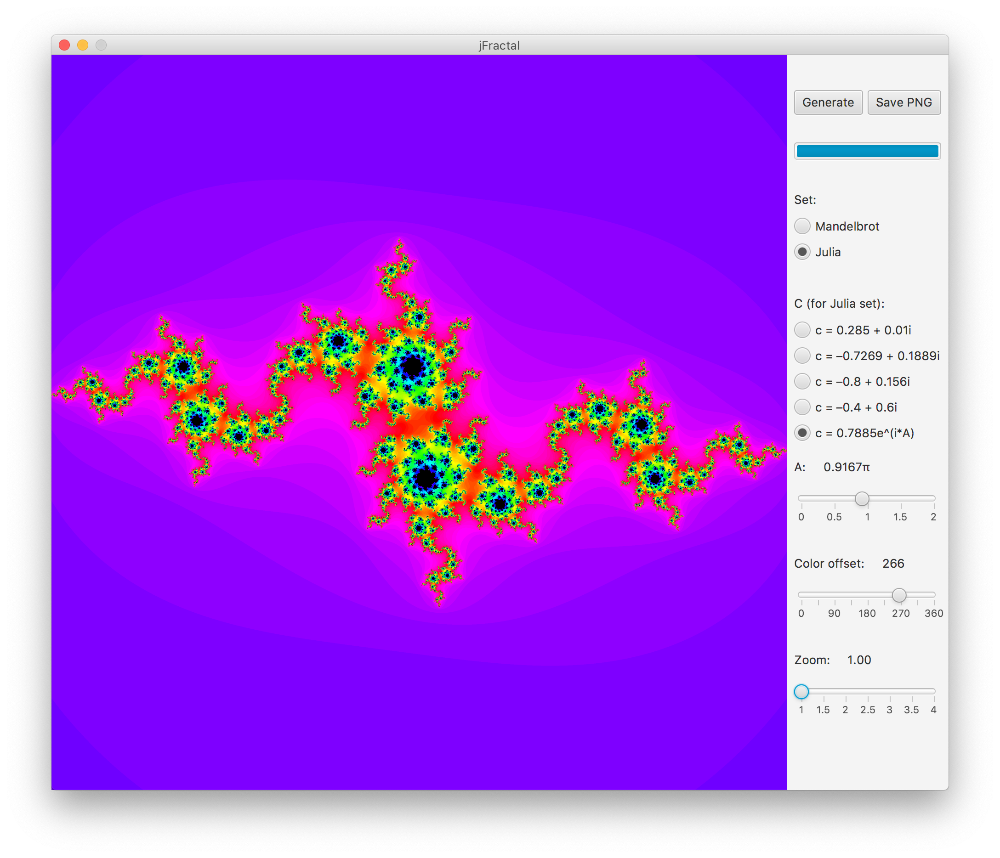

# jFractal

This is an implementation of an algorithm that generates visual representations of Mandelbrot and Julia sets in Java.

Requires JavaFX and my own [Complex class](https://github.com/SpinningVinyl/java-complex-numbers).

## Usage

This application is completely useless in the practical sense, its only purpose is to generate pretty pictures.

It can be used to visualise the Mandelbrot set or the Julia set. Since the Julia set really depends on the constant part of the equation, this app allows you to change it (to some degree).

The color offset slider allows you to change the colours of the output. (The value of the slider is added to the hue component of the colours generated by the application, that's why it goes from 0 to 360.)

The zoom slider zooms the image. Click + drag to move it around, double click to reset to the default zoom level.

### License

This project is shared under the terms of [CC BY-NC-SA 4.0](https://creativecommons.org/licenses/by-nc-sa/4.0/) license.
